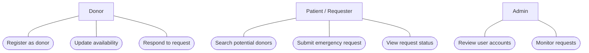

```mermaid
flowchart TB
 Donor[Donor] --- UC1([Register as donor])
 Donor --- UC2([Update availability])
 Donor --- UC6([Respond to request])
 Requester[Patient / Requester] --- UC3([Search potential donors])
 Requester --- UC4([Submit emergency request])
 Requester --- UC5([View request status])
 Admin[Admin] --- UC7([Review user accounts])
 Admin --- UC8([Monitor requests])
```