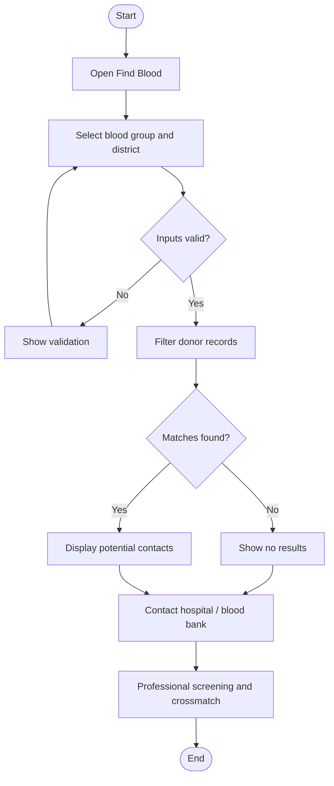

```mermaid
flowchart TD
 A([Start]) --> B[Open Find Blood]
 B --> C[Select blood group and district]
 C --> D{Inputs valid?}
 D -- No --> E[Show validation] --> C
 D -- Yes --> F[Filter donor records]
 F --> G{Matches found?}
 G -- No --> H[Show no results]
 G -- Yes --> I[Display potential contacts]
 H --> J[Contact hospital / blood bank]
 I --> J
 J --> K[Professional screening and crossmatch]
 K --> L([End])
```