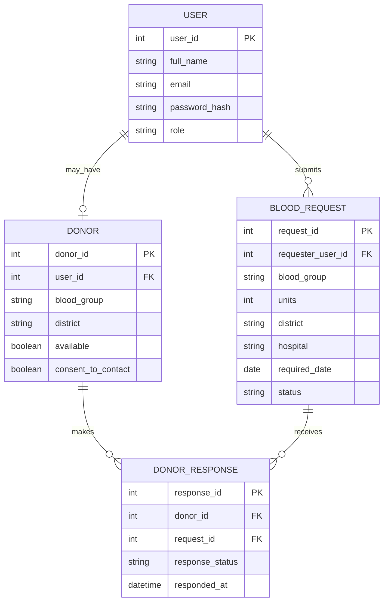

```mermaid
erDiagram
 USER ||--o| DONOR : may_have
 USER ||--o{ BLOOD_REQUEST : submits
 DONOR ||--o{ DONOR_RESPONSE : makes
 BLOOD_REQUEST ||--o{ DONOR_RESPONSE : receives
 USER { int user_id PK string full_name string email string password_hash string role }
 DONOR { int donor_id PK int user_id FK string blood_group string district boolean available boolean consent_to_contact }
 BLOOD_REQUEST { int request_id PK int requester_user_id FK string blood_group int units string district string hospital date required_date string status }
 DONOR_RESPONSE { int response_id PK int donor_id FK int request_id FK string response_status datetime responded_at }
```