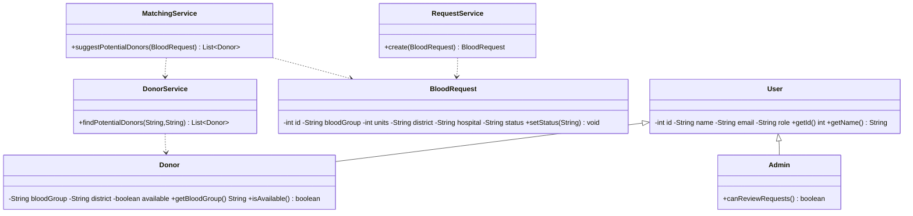

```mermaid
classDiagram
 class User { -int id -String name -String email -String role +getId() int +getName() String }
 class Donor { -String bloodGroup -String district -boolean available +getBloodGroup() String +isAvailable() boolean }
 class Admin { +canReviewRequests() boolean }
 class BloodRequest { -int id -String bloodGroup -int units -String district -String hospital -String status +setStatus(String) void }
 class DonorService { +findPotentialDonors(String,String) List~Donor~ }
 class RequestService { +create(BloodRequest) BloodRequest }
 class MatchingService { +suggestPotentialDonors(BloodRequest) List~Donor~ }
 User <|-- Donor
 User <|-- Admin
 DonorService ..> Donor
 RequestService ..> BloodRequest
 MatchingService ..> DonorService
 MatchingService ..> BloodRequest
```