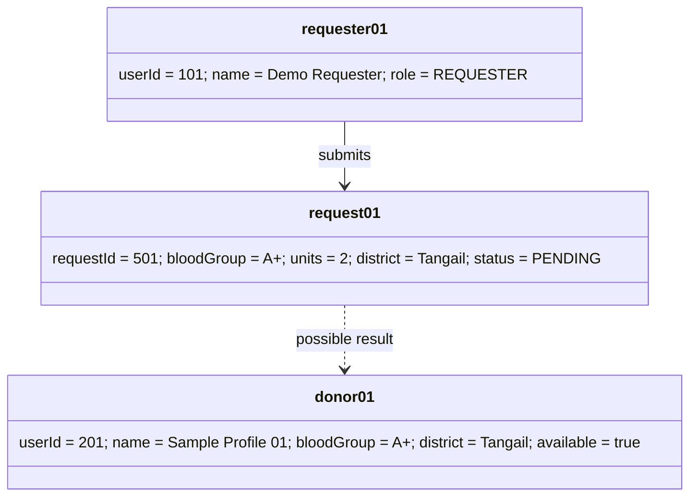

```mermaid
classDiagram
 class requester01 { userId = 101; name = Demo Requester; role = REQUESTER }
 class donor01 { userId = 201; name = Sample Profile 01; bloodGroup = A+; district = Tangail; available = true }
 class request01 { requestId = 501; bloodGroup = A+; units = 2; district = Tangail; status = PENDING }
 requester01 --> request01 : submits
 request01 ..> donor01 : possible result
```